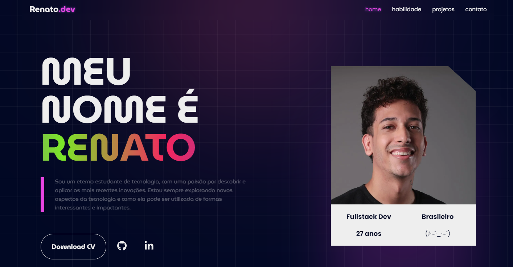

# Portfólio Pessoal

[](https://reactjs.org/)
[](https://getbootstrap.com/)
[](https://developer.mozilla.org/en-US/docs/Web/JavaScript)
[](https://developer.mozilla.org/en-US/docs/Web/Guide/HTML/HTML5)
[](https://developer.mozilla.org/en-US/docs/Web/CSS)
[](https://pages.github.com/)

[](https://renato-figueiredo.github.io/portfolio-pessoal/)

## Capturas de Tela




## Sobre o Projeto

Este é um portfólio pessoal desenvolvido com **React**, **Bootstrap**, **JavaScript**, **HTML5** e **CSS3**, hospedado no **GitHub Pages**. O objetivo deste projeto é apresentar minhas habilidades como desenvolvedor front-end e fornecer um local onde eu possa compartilhar meus projetos e informações de contato.

## Como Executar o Projeto

Para rodar o projeto, siga os passos abaixo:

### 1. Instalar as dependências
```bash
npm install
```

### 2. Rodar o projeto no modo de desenvolvimento
```bash
npm start
```

Isso irá iniciar o servidor de desenvolvimento e abrir o site no navegador.

## Estrutura do Projeto

O projeto está organizado da seguinte maneira:

```bash
src/
├── components/
│   ├── Contacts.js            # Componente da seção de contato
│   ├── CustomHook.js          # Hook customizado para funcionalidades específicas
│   ├── Home.js                # Componente da página inicial
│   ├── NavBar.js              # Componente de navegação (header)
│   ├── Projects.js            # Componente que lista os projetos
│   ├── Skills.js              # Componente para mostrar habilidades
│   └── useCopyToClipboard.js  # Hook para copiar texto para a área de transferência
├── redux/
│   ├── action.js              # Ações do Redux para gerenciar estados
│   ├── reducer.js             # Redutores do Redux
│   └── store.js               # Configuração da store do Redux
├── static/
│   └── media/                 # Arquivos estáticos
│       ├── avatar.webp        # Imagem Pessoal
│       ├── cv.pdf             # Currículo em PDF
│       ├── project-IA.webp    # Imagem do projeto gerada por IA
│       └── project-mgpocket.webp  # Imagem do projeto MG Pocket
├── App.css                    # Arquivo CSS principal
└── App.js                     # Componente principal do React
```

## Comandos Úteis

### Criar o build do projeto para produção
```bash
npm run build
```

### Fazer deploy no GitHub Pages
```bash
npm run deploy
```

Esse projeto utiliza **React** para o front-end e **Redux** para gerenciamento de estado.
